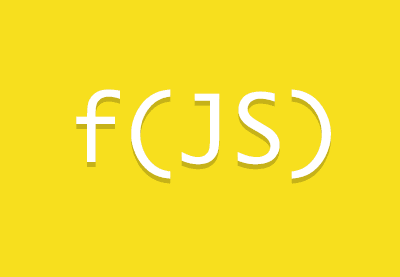

# programacao-funcional-javascript

<h1 align="center">
    
</h1>

  

  
  
  

  

Aplicação de conceitos de paradigma funcional utilizando JavaScript.

Uma das vantagens em se trabalhar com programação funcional é que parte da responsabilidade é assumida pela própria linguagem, evitando por exemplo a necessidade em criar laços, variáveis, operações...

Além disso, a composição de funções por meio da programação funcional deixa o código mais organizado.